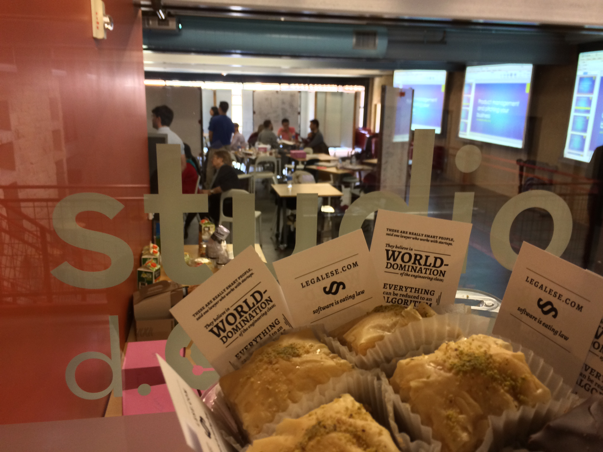
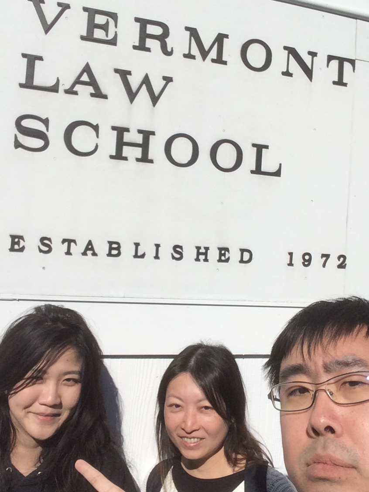
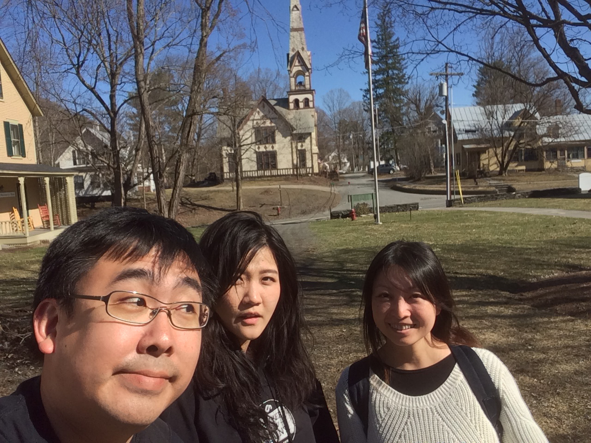

Dear Legalese Wellwishers,

It has been an exciting few months, full of activity. Some of the activity was anticipated. Some was not. All of it was consistent with the larval stage of a deca-unicorn.

In our last newsletter (Dec 2016) we forecast that we would
* build the first iteration of the V2 product
* draft a few more legal agreements in L4, thus converging on a language design
* sort out Legalese’s ESOP structure in a way that can generalize to other startups
* hire our first few staff members under our hybrid cash/equity plan

**Build the first iteration of the V2 product.** V2 product development is now well underway. In January, three members of the Legalese team visited and handshaked with an agile dev shop based in Bangkok which we have known for many years. They have assigned a full-time team of developers + project manager + tester + designer to us. These insta-resources made it possible for them to achieve early feature parity with our v1 product in only three short months! Based on current velocity we expect to reach our Angel Tranche 2 milestones sometime this summer. So product development is on track. Alexis, having inhaled a number of UX books, is taking the role of acting product manager, attending meetings with the dev team on a daily-to-weekly basis; I take the role of senior product manager and weigh in with technical contributions on our Slack chat.

**Also on track is our research effort.** As you will recall, we are building a language for law, code-named L4, which will do for the legal industry what SQL did for the database industry. This is what most people seem to be most excited about. (The v2 app will stand up just fine, but the L4 work represents our deep-tech IP and will be the basis for Legalese’s future tech stack.) Developing a language takes years, especially when the underlying logic for the language needs to be worked out in tandem. The technology choices we have made over the past year (e.g. Haskell and GF) have been borne out, and we seem to be on the right path toward the eventual goal. Our months-long research survey uncovered a number of contract languages from academia, and we have spent time reviewing each one in detail, so we can learn from the past. While we are informed by work on the CL language which dates back 10+ years, our L4 work is more directly inspired by the CSL formalism developed in 2013. CL’s main contributions are support for natural language and for model checking. CSL’s contribution is a fully worked-out formalism which does for contracts what Codd’s relational algebra did for databases. We aim to use the strengths of each. But this is getting to be too technical of a tangent.


**Draft a few more legal agreements in L4, thus converging on a language design.** The goal of drafting a few more legal agreements in L4 is not yet met. What happened instead? In February, Meng went to Berlin for a conference, “hacking.law”, with [thought leaders](http://www.nytimes.com/2013/12/17/opinion/brooks-the-thought-leader.html) from the European LegalTech community. (Meng’s presentation [here](https://www.youtube.com/watch?v=RNm1aY-Umew).) One researcher from the conference is working on a contract language for Ethereum. Together with a few other researchers we are kicking off a small project to draft standard legal agreements across a number of languages, including L4, so as to provide a sort of Rosetta Stone – or RosettaCode – to learn the strengths and weaknesses of different languages. So that project has expanded, and is still going on.


**Sort out Legalese’s ESOP structure in a way that can generalize to other startups.** We have planned in detail an ESOP architecture which should work for us and for other startups. We will open-source this architecture for others to use. For Legalese, we intend to set the pool size at 75% – much larger than the usual 15% to 25%. Why? To keep cash burn down, and also to recognize opensource contributors. (We discussed the mechanics with a Singapore lawyer a few months ago, and again last week, briefly, with a Boston VC with multi-round financing experience, who gave us a rough thumbs-up.) The ESOP has been a lower priority because it does not affect the angel round. It should be in place by the time we go for our seed round.

**Angel Round Raised!** We closed the first tranche of our angel round funding in December. The round was led by Walden and followed by a number of angels. All of the tranche 1 investors have made commitments toward tranche 2, mostly in equal or larger amounts. The second tranche funds will be triggered by product development milestones. You can read our press release [here](http://www.waldenintl.com/docs/Press%20Release%20-%20Legalese%20Angel%20Round%2020170109%20%5Breadyforcirculation%5D.pdf); the story was also covered in the usual blogs. We were also featured in [ThomsonReuters as a Hot Startup](http://www.legalbusinessonline.com/news/alb-insights-alb-hot-startups-legalese/74162).


**Hire our first few staff members.** We have contracted a couple of junior engineers to help with maintenance of the v1 system. Our fixed burn remains very low as the founding team are not drawing any salary. The largest expenses are accruals toward outsourced product development. We have a few thousand dollars’ worth of one-off expenses, sending team members to various conferences and summer schools.

**Management Note.** I have to say I am proud of our financial approval process, which is relatively mature for a startup this young: the relevant operating circle first approves the expenditure as being in the interests of the company and appropriate to the staffer, then the finance circle reviews the submitted expenses and proceeds with funds disbursement. I am glad that I have removed myself from this process as much as possible, so that I am neither a bottleneck nor a dictator-by-default. You will note from our language that we are working according to Holacratic principles, and are conscious of the [importance of process](https://kateheddleston.com/blog/the-null-process).


# General Report

That covers our forecast round-up. What else has happened in 2017?

## Executive Summary

We are making good progress on product development, which leads toward revenue experiments which in turn will justify the next few rounds of funding. We expect our v2 product to be delivered on time and under budget.

We are making good progress on R&D, including academic/industry partnerships at Harvard and Stanford and in Europe. The foundational research continues; with a small team of only three and a half dedicated but unpaid researchers, it is going slower than we would like, though not slower than we expected. We are learning a lot, which is the right thing to do at this point. We have developed a picture of who’s doing what in the field. We have a very good idea which postdocs we would like to hire after we raise a seed round.

A few government agencies, law firms, legal academies, and research orgs have reached out to us. While they do not currently hold the promise of revenue or investment, these relationships could mature one day. We engage with these contacts as our time permits.

We continue to build our brand and monitor the LegalTech space by attending events where we share our story and recruit collaborators. We also engage on Twitter, our social media channel of choice.

We are on track to trigger the second tranche of angel funding in the coming months, to be followed by a seed round around the end of 2017.


# Industry and government engagement
Alexis wrote this section.

## Legal industry

On 14 Dec last year, I was invited by the Singapore Academy of Law (SAL) to participate in a focus group looking into legaltech and the future of law. At the session, my key argument was that the legal profession ought to be considered separately from the legal industry, and with that in mind, the SAL that’s headed by the chief justice ought to serve the consumers of legal industry, rather than simply the profession. The distinction is important for disruptive innovations like Legalese as we are not looking to serve the incumbent law firms via a service, time-for money model, but rather, bypass them altogether and productise legal services direct to consumer. 

That culminated in the [Legal Technology Vision](http://www.lawnet.sg/lawnet/documents/10678/171991/Legal+Technology+Vision+(final+for+print).pdf/fdc04db4-2e02-41c4-a1ee-14553ba77ad1) which was endorsed by Chief Justice Menon at the opening of the 2017 legal year. We got a lovely little mention under the Smart Contracts section. 


## IMDA
Following the Legal Technology Vision mention and TiA article announcing our funding round, an industry development group from IMDA (what was previously IDA) reached out and asked to chat. Meng, Chiah Li and I attended the meeting and had an interesting discussion about a potential collaboration with IMDA. They were forthcoming on his KPIs for the project – to energise the startup and tech space in Singapore, with clear deliverables every 6 months that IMDA can tout. IMDA expressed that they wanted to be the body that pounds on the doors of other agencies and government bodies for us. Off the top of our heads, we mentioned ACRA, MAS, and the Data.Gov folks as probably the most immediately useful ones. Following that, we have written up an extensive proposal on the research, funding, and manpower required for Smart Contracts, Smart Statutes, and the Web-App Product Development. We set out proposed key deliverables that serve both IMDA’s objectives and Legalese’s roadmap.

[Meng says: we always treat government work as a nice-to-have, but not a must-have; if this proposal falls through, our primary mission objectives are not compromised.]

# Fundraising

## Spring Singapore

Another government body whose interest in Legalese was piqued by the Legal Technology Vision and TiA mention, is Spring Singapore. They reached out to us to ask about our funding roadmap, and whether we’ve considered applying for [Spring SEEDS](https://www.spring.gov.sg/Nurturing-Startups/Pages/nurturing-startups-overview.aspx), the equity-based co-financing arm of Spring (matching up to $2 million). We expressed pleasant surprise at the question, as the understanding we had on the ground was that Spring SEEDS was for more mature startups. The officer we spoke with was confident that we were well within the profile, and he would be interested in looking into Legalese for Spring SEEDS. —Alexis

[Meng says: again, we always treat government money as a nice-to-have, but not a must-have; if SPRING dries up for any reasons, our primary mission objectives are not compromised. As someone who has been on a government subcommittee on the future economy, and has served on committees to approve SPRING grants, I know the difference between the government talking the talk and walking the walk. Nobody wants to waste time on a wild goose chase, but as “customers” of the Singapore innovation ecosystem we want to be able to offer a future case study in what worked and what didn’t, hence we are being extra diligent in pursuing every opportunity in the system.]

## Lawyers in SG
In January, we met a couple of wealthy, very senior lawyers in Singapore. They were impressed by our vision and understood the potential of our technology to be both an opportunity for and a threat to their profession. However, they have little to no experience making angel investments and are therefore unlikely to invest; lawyers are risk-averse. We knew that the legal industry is one which generally does not invest in innovation, and this outcome suggests a specific hypothesis: that successful lawyers in Singapore do not invest in legal innovations, as compared to, say, successful software engineers in the Valley investing in software innovations. —Meng

## Frontier Ventures
Chiah Li and I met with Frontier Ventures, who had reached out to us to connect. Of course we apologised for not including them in our fundraising roadshows last year, as we suspected that they were only looking at more established startups. The managing partner, a programmer himself, was excited about what we were doing, and felt that the disruption to the legal space was inevitable. We will come back to them when we have more milestones. —Alexis

## Vickers Ventures Partners

We were invited to the Vickers CNY party. We had previously pitched to them and received strong interest. I’ve promised to keep them updated when we’re raising the next round.   —Alexis

## A Variety of VCs in Boston
In April, Chiah Li and Alexis turned up at Meng’s apartment in Cambridge. Legalese presented to the Entrepreneurs Club at Northeastern University, and a number of introductions to local VCs ensued. We met Hyperplane.vc, who were impressed. They referred us to Underscore, who we will meet tomorrow. We will spend the month of May reaching out to Boston-area VCs to build relationships toward our seed and Series A rounds. As we do, we will give preference to VCs who have operational CS and software experience as working programmers. Most investors get the pain point right away, but it takes a software person to really appreciate the solution. —Meng

# Other Contacts

## Templates from General Standards
In January, I had coffee with someone from General Standards. They are startup lawyers doing startup documents and advice in bulk, and he expressed interest in porting their templates into our system. We agreed to keep in touch on this as I suspect that it’d be more relevant only after v2 is fully up.  —Alexis

## Kadena.io and Pact
In April the Boston Haskell meetup hosted Stuart Popejoy from Kadena.io presenting Pact, his smart contract language, which sits in approximately the same place as Ethereum’s Solidity. This presentation, together with a previous beer meeting with [adjoint.io](http://adjoint.io), validated our choice of Haskell as a development language. Kadena has, in less than 12 months, built a working high-performance blockchain and a smart contract language to go with it, with only a two-man team. It would not have been possible without Haskell. — Meng


## Berkman Klein Center at Harvard University
Meng has been on a yearlong fellowship at Harvard, interfacing with Harvard faculty and with other Berkman fellows. In March, Meng guest-lectured a Harvard Law School class on Programming for Lawyers. On April 25, Meng and Alexis presented Legalese before an audience of about 30 Berkman fellows and affiliates, to general encouragement. We explored the social implications of opensourcing and automating aspects of contract development and legislative/regulatory drafting and interpretation. Investor introductions followed.

We are also recruiting from the pool of researchers we met in Cambridge.

## Data61 / CSIRO / Nicta
In November 2016, Data61, a research flagship out of Australia’s CSIRO + NICTA research institute, launched [digital-legislation.net](https://digital-legislation.net/), which aims to do for statutes (using defeasible reasoning) what Legalese aims to do for contracts (using deontic logic). In April, Legalese did a couple of phone calls with Data61 to learn about their technology and explore opportunities for engagement. We are now looking through their codebase. It is impressive.

“Smart Statutes” seems like a natural fit with Singapore’s “Smart Nation” initiative. It would be nice if we could partner with A*STAR or other Singapore IHLs on these topics. But if Singapore’s research institutes do have similar strengths in formal verification, automated legal reasoning, and programming-language theory applicable to computational law, we will need to work harder to locate them. Most of the academic expertise in this domain turns out to be European.

## Stanford’s CodeX Center for Legal Informatics

In early April, Meng and Alexis attended Stanford’s FutureLaw conference. On display was some of the state of the art in LegalTech, and we were encouraged by what we saw: we continue to believe that Legalese will enter the market neither too early nor too late.


FutureLaw: at left, the Geschäftsführender Direktor of Bucerius Law School has invited us to visit and teach his students.

At a private, invite-only workshop ahead of the FutureLaw conference, Meng did a brief presentation about the past, present, and future of contract languages. Subsequently, Meng was invited to join CodeX as a fellow starting in the fall of 2017, and has received a blessing from a previous leader of [compk.stanford.edu](http://compk.stanford.edu) (who has left the project) to more or less take over.

Following FutureLaw, we attended a startup-weekend type hackathon organized by the Stanford Law School, hosted at the legendary d.school. We were impressed by the entrepreneurial energy on display, even amongst the law students: we read it as a sign that they are taking Susskind seriously. It was interesting to see that in a room of about 50 people there were at least 2 Singaporeans not counting the Legalese team.



We brought $100 worth of baklava to the hackathon. It was a hit.

Later in April, following on from the workshop, Meng, Chiah Li, and Alexis road-tripped up to Vermont Law School to meet with Prof. Oliver Goodenough and brief him on Legalese’s research in contract language development.





Shortly after these photos were taken, Chiah Li was stung by a wasp on her pinkie :-(

These academic relationships help to confirm our “tech transfer”. [Commercializing research that is coming out of the lab](https://hbr.org/2016/04/innovative-companies-get-their-best-ideas-from-academic-research-heres-how-they-do-it?utm_campaign=hbr&utm_source=twitter&utm_medium=social) offers a strong basis for IP differentiation: it helps build a moat and suggests that our innovation isn’t a me-too. Many investors care about these things.

## Ethereum

In April, Virgil joined Ethereum Asia Pacific in Singapore as “Scientist” working with Vitalik Buterin on issues related proof of stake and game theory. Being close to the action is important because Ethereum is a possible compilation target for our language. This has been our plan from the start and is consistent with [recent scholarship](https://papers.ssrn.com/sol3/papers.cfm?abstract_id=2959166).

## FOSS Asia
Virgil has also been very active on the evangelist front, talking about Legalese to everyone in his extensive network. In March, Virgil gave a talk on Legalese at FOSS Asia, and thereby recruited a number of useful contacts to our Slack chat. Virgil and Anuj also tag-teamed a conference in India.

# L4 research & development

## Singapore

In January, we hosted a dinner with researchers from academia and from industry, largely recruited by Virgil, to discuss the technical, research, and development possibilities and applications of L4. These researchers continue to participate on our Slack discussions. (Note for foodies: we went to http://kombirocks.com/; the ngoh hiang is a must-try.)

## Internationally

At Harvard, Meng recruited a couple of SEAS CS faculty to advise us on L4 R&D.
Meng had a long chat with [Vinay Gupta](https://www.vice.com/en_dk/article/global-resilience-guru), whose recent [Internet of Agreements](http://www.the-blockchain.com/2017/02/13/hexayurt-capital-presents-internet-agreements-world-government-summit/) talk at the World Government Summit features heavily in our IMDA proposal. If our Smart Statutes line of work goes anywhere with a government body, we may involve Vinay in some capacity.
Besides hacking.law in Berlin, Meng attended a variety of workshops, meetings, and conferences in Copenhagen (Robo-ethics), Salzburg ([IRIS2017](https://www.univie.ac.at/RI/IRIS17/)), Munich ([legal formalization](https://wwwmatthes.in.tum.de/pages/1jfv92lb1sq8q/Bernhard-Waltl)), and New Haven at Yale (Robo-lawyers). Meng also worked through textbooks on Haskell, GF, Alloy, and model checking. Vi is working on programming language theory in Agda.

## Snapshot
The latest language definition looks like this.

```
            LABEL   labelName:
       SUBJECT TO   clause-combo
  NOTWITHSTANDING   clause-combo
             WHEN   predicate
            PARTY   p 
            SHALL   [NOT] action-combo
            WHERE   action-expression
         PROVIDED   rule(params)
           BEFORE   (deadline) REMAINING Z
            HENCE   clause-spec (args including Z) | FULFILLED
      ELSE | LEST   label2 | party BREACH
	  
```

Does this look like something a technically minded power user with a little bit of legal experience could pick up, given lots of examples and a realtime compilation engine that outputs to English? I hope so. By the way: any similarity to SQL is absolutely intentional.

If you are familiar with CSL, you will see how much of the above is mere syntactic sugar around the bones of the existing formalism. The rest is a rule expression language; together we should be able to express both defeasible rules a la LegalRuleML, and deontic/temporal logic a la CSL and CL.

# Forecast and To-Do List

**R&D research.** In the coming months, members of the Legalese team will fan out across the world attending summer schools and conferences.

* Virgil: [Oregon Programming Languages Summer School](https://www.cs.uoregon.edu/research/summerschool/summer17/) in Eugene
* Vi: [Coinduction in Type Theory](http://lama.univ-savoie.fr/~hirschowitz/CoTT2017/) in old Savoy, [DeepSpec Summer School](http://deepspec.org/events/ss17detail.html) in Philadelphia
* Meng: [ICAIL](https://nms.kcl.ac.uk/icail2017/) and [RuleML](http://2017.ruleml-rr.org/decisioncamp-2017/) in London, [SC2](http://www.sc-square.org/CSA/school/) in Saarbrücken, [GF](http://school.grammaticalframework.org/2017/) in Riga
* Chiah Li: [Grammatical Framework](http://school.grammaticalframework.org/2017/) in Latvia
* Gauntlet173: [Law and Logic](https://lawandlogic.org/) in Florence

These courses are an investment in IP. They represent capability development on the R&D front. They are also an investment in HR. We meet people who we might one day recruit to join Legalese.

**Product.** Soft-launch the v2 product at v1 feature parity, with better UI. Get the company used to supporting end-users. Improve usability. Test revenue models. Test customer loyalty across different legal verticals: will a startup that used us for their fundraising also use us for their employment agreements, NDAs, etc? Start dovetailing the v2 product with the L4 R&D.

**Admin.** Set up the ESOP. Hire an outside bookkeeper to manage the expense tracking and reporting.

**HR.** Start recruiting researchers, with the expectation that we might hire them in 9 to 18 months.

**R&D dev.** Build some working software around L4, starting with EDSL in Haskell, followed by full compiler, language spec, extensibility mechanism, NLG engine targeting at least two natural languages, and gateway to model checker; we want to detect at least two of the Well Known Contract Bugs on our list. Start developing a framework for translating Ken Adams’s book into code. Work with the Rosetta Stone collaboration. Work through the Common Accord codebase to see if there is room for collaboration. Disassemble DocAssemble.

**External Developer Relations.** Develop a curriculum leading toward a “L4 Legal Engineer” badge explaining to a would-be contract / legislation / app developer how to code in the language, automate the tedious parts of document construction, and use the model checker as a power suit, without having to know the underlying math.

**Internal Developer Relations.** Develop a curriculum leading toward a “Core L4 Developer” badge covering contract logics, rule logics, model checking, language-based security, programming language theory, and natural language processing.

**Fundraising.** Continue conversations with seed and Series A funds in the US and Europe. Develop a shortlist of investors willing to join the next few rounds.

# Things We Want To Do Differently

Better onboarding process for opensource contributors. We get a lot of nibbles but those nibbles don’t always convert to bites. To some extent this is natural and a good thing: opensource projects are self-selecting. And this will change once we have stood up a working stack, with the language running all the way through to apps. Right now the R&D is still functionally in vapourware stage. For now, I wish we could improve our onboarding process and I wish our community were as engaged on our email forum as they are on Slack.


That’s all for this newsletter! Sorry for the hiatus, I hope to be more regular in future.

cheers
meng
