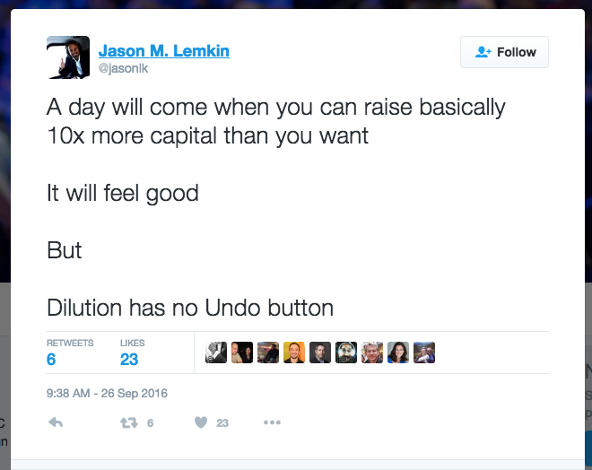

Dear [wellwishers](http://wellwishers.lists.legalese.com),

This is a double issue of our monthly newsletter, covering both August and September 2016. Why was there no September issue? Because this time last month your faithful correspondent was in the middle of a desert, extremely off-grid, 125 miles away from wifi, electricity, and running water; his laptop stayed sealed in a ziploc bag for an entire week, for fear of toxic alkali dust. Of course, aside from that, Burning Man was great!

In our last newsletter, we said we would soon aim to confirm commitments toward our Angel Round, Tranche 1, and pull the trigger on v2 development.

Well, we’ve done some of that. Our angel round is oversubscribed. We have almost a dozen angels and seed funds in our cap table, marked as “tentative”. So why haven’t we closed? Because our cost of product development might not be quite as high as we had expected, and we don’t want to raise money that don’t have to spend.

A few days ago, this tweet appeared: 

To build the v2 system and de-risk our product/market fit, we originally budgeted $1M. Right now it’s looking closer to $250k, and that’s an amount that I can basically cover myself – especially if we get approved for the TECS POC grant, which promises to reimburse up to $250k. For that money we should be able to double our valuation and hit the milestones for seed funding. So it’s a possibility – not a sure thing, but maybe – we might skip the angel round, or go for a single, bigger, later, angel tranche.

Why did our dev estimate drop from $1M to $250k? $1M is what development would cost in the US. But we’ve lined up two candidate dev teams, one in India, one in Thailand. Things are cheaper in Asia. For redundancy we may hire both teams to work on the codebase together. Who knows – even with two teams, we might be able to come in under $250k.

That’s the main reason our activity on the fundraising front has been a little slow. It hasn’t stopped, we’re just moving forward on other fronts, that help build value – and valuation!

# Grant Revenues

In our last newsletter we talked about receiving a US$8,888 grant from String Labs.

In August we received another grant, this time for S$30,000, from ISIF.Asia. That’s another huge thumbs-up: it validates the problem domain and the potential market for our product. They’re excited to see us apply our technology to help entrepreneurs in Southeast Asia raise funds, with less friction and at less cost.

With all that money, on our current burn rate we’re basically in the black for the next two years.
Of course, we aren’t going to keep getting grants forever. Our burn rate will go up once we start building v2 and v3, so our investors should expect us to come around with hat in hand sooner or later.

# Budget and Events
What have we spent money on?

In the last two months our Bangalore-based contract developer got up to speed with our v1 code base and started contributing significant patches.

We sent two contributors – Virgil and vi – to DEVCON2 in Shanghai, where our [work on L4](https://docs.google.com/presentation/d/14JLUqa1but_kyg0zCkbSkspAs2491kx3q9esy1H0OFw/edit#slide=id.p) and smart contract security was well received. These kinds of public appearances build a brand and will pay off down the road.

# Harvard
Already, people have come up to me and said, “oh, you’re doing Legalese, right? Someone told me about your project and I want to talk to you about it.” That has happened a few times in the past month, on campus at Harvard.

Why Harvard? I’ll be spending the 2016–2017 academic year as a Fellow of the Berkman Klein Center for Internet & Society. Already I have made good connections with computer scientists at the school of engineering at Harvard, and with polymaths at the MIT Media Lab. Berkman Klein is a well-funded think tank that hosts all kinds of interesting Internet/Technology projects, and Legalese is smack in the middle of their interests in legal automation, blockchain, and smart contracts.

In November, a couple members of the Legalese team will join me in Cambridge, MA, where we will take advantage of the proximity to big brains to do more work on the language core of v3, while product development on v2 goes on in parallel in India and Thailand.

# Fundraising
Hey! Did you know Donald Trump is running for President? First Brexit, now this! 2016 is turning out to be the [wackiest timeline ever](http://www.nytimes.com/2016/10/03/world/colombia-peace-deal-defeat.html).

So, how would Donald talk about our fundraising?

> Since our last newsletter we met with a couple of VCs in Singapore. Big names. Names you would know. Some of the best. And they got it. They were very positive. Not just positive – yugely positive! They wanted to join the round. How yuge is that? Usually they don’t go in before Series A. But for us, they sought special permission from their investment committee to come in on our Angel and Seed rounds. And by “come in” I mean “possibly take the whole round.” That’s so yuge, even I can’t believe it!

Thanks for that, Donald!

So we are trying to juggle that level of interest, while giving our angels – with whom we have longstanding relationships – some way to participate.

We’re also talking to more VCs in the US. In two weeks I’ll be on a yacht in the Bay Area, at [h2.co’s global summit](http://h2.co/h2o), and I hope to touch base with Floodgate again then, and whatever other VCs show up. We’ve noticed a trend: VCs with backgrounds in software, and have spent a lot of time dealing with lawyers, really get it. And when I say backgrounds in software, I don’t just mean investing in software companies – I mean as software developers who know the tricks of the trade and can see how they map to legal. We might get interest in the Valley. We might get interest in Cambridge.

# Forecast for October 2016

In October we will
* continue v2 specification, architecture, and development
* ship a term sheet and definitive documentation to investors for review, and
* prepare to present a draft of our very early work on L4 at Geekcamp Singapore (Oct 24) and at the Hackers Conference (Nov 5).

That brings our regular newsletter to an end; now we move on to a special feature.

# Special Feature: What’s the difference between Legalese and Otonomos?

One of our potential investors has been digging really deep into our product. So deep, he’s running one of his current angel deals through Legalese.

The other day, he asked a good question. So good that everyone, we think, deserves to see our answer. (Also, because we like to treat our investors pari passu, we try to say the same things to all our shareholders.)

## What’s the difference between Legalese and Otonomos?

[Otonomos](http://otonomos.com) is a blockchain FinTech startup in Singapore.

But we are very different in our philosophies and where we want to go. Let me talk philosophy for a minute.

At JFDI, I had a ringside seat studying innovation for six years. Over the course of 70 investments, Hugh and I taught Clayton Christensen’s models of *disruptive innovation* and *jobs to be done*; Geoffrey Moore’s *chasm, bowling alley, and tornado theories*, Sangeet Paul Choudary’s playbook of how to build a platform business; Everett Rogers’s strategic *diffusion of innovations*, which goes all the way back to 1962; and of course Steve Blank’s model of *customer development*, all the rage among Lean Startups today.

From that Silicon Valley canon, and from our own experience launching, investing in, and mentoring startups, Hugh and I drafted a pattern library (inspired, of course, by Christopher Alexander) of startup success and failure. We know that the history of innovation is littered with *a solution looking for a problem*, usually *a technology that’s too far ahead of the market*, that suffers *first-mover disadvantage* while the *fast followers* take time to figure out the business model, not just the product.

In my own history of entrepreneurship I have noticed a pattern of getting excited about ideas that were two to five years ahead of their time. I wrote a photogallery before Flickr, I launched a commercial email service before Hotmail, I built an anti-spam engine before Barracuda. So? There’s no point starting first if you don’t also finish first. And that’s the lesson of the Gartner Hype Curve: from lab to launch to listing takes years, sometimes decades. The best evidence that ideas, alone, are worthless: just look at Paul Baran’s [Brief Descriptions of Potential Home Information Services](http://www.iftf.org/our-work/people-technology/the-human-internet/forecasting-the-internet/), which pretty much predicted the modern commercial Internet … way back in 1971.

That’s why, with Legalese, we’re not keeping the stereotypical Silicon Valley, 80-hour week, sprint-after-sprint tempo that leads inevitably to burnout. Many startups race after a mirage. It’s only when you’re clearly inside the tornado that you need to hustle.

Do I say all that with blockchain startups in mind? Yes. [According to Gartner](http://www.gartner.com/newsroom/id/3412017), blockchain hype is peaking; but it’s still 5 to 10 years away from mass adoption. And that means a lot of dead startups who saw the potential but failed to realize it: startups who created value, but couldn’t capture it.

Does Otonomos fall into this category? Let’s see. Where did they start, and where are they now? According to the founder’s statement on the website:

> The idea came to me in summer 2014 whilst spending time in Silicon Valley, where I sensed an early movement to use distributed processing power to let anybody with access to a computer invest, borrow, contribute, shop, manufacture, vote, donate, spend and earn without the need for a central authority.
> It was this promise of a decentralised financial infrastructure for the future that prompted me to incorporate Otonomos in early 2015 upon my return to Singapore, and start building a team around the idea who would bring the same passion and dedication to executing it.

How do I unpack this? “I visited the Valley and got some exposure to 2014-vintage Bitcoin cypherpunk anarcho-libertarianism. This culture was totally new to me and I immediately set out to build a business on the potential of blockchain technology. One of the ideas that was in the air at the time, was that everything would be decentralized; asset ledgers of all kinds: real estate titles, vehicles, commodities – not just currency. As an entrepreneur I knew one kind of asset ledger intimately: shareholder rosters are firmly stuck in the 18th century, so why not move it onto the blockchain?”

From Han’s LinkedIn page:

> V2.0 OF THE LIMITED COMPANY
> Otonomos is offering on a new operating system for the limited company: a company with digital shares, held in a cryptographic wallet, transferable peer-to-peer, programmable like software, and powered by the decentralized blockchain.

> A CRYPTOGRAPHIC SHARE WALLET FOR EVERY SHAREHOLDER IN YOUR COMPANY
Think of Otonomos as the online portal to form, fund and govern your company in a number of leading jurisdictions around the world. Go to otonomos.com to form your company by simply creating a digital share wallet. We then make sure a real-world private limited company is incorporated and that all is compliant. 

> POWERED BY BLOCKCHAIN
> Once your company is formed, we represent your shares on the blockchain, the distributed ledger that allows you to track who your shareholders are at all times, and send shares peer-to-peer, e.g. when you raise funds. 

> COMPANY SHARES AS SOFTWARE
In addition, we make your shares programmable so routine governance actions can be administered with the press of a button from within your dashboard.

Speaking as a technologist at heart, this all sounds genuinely exciting; it feels like *The Right Thing And Why Not*?

But, if [Steve Blank](https://en.wikipedia.org/wiki/Steve_Blank) were here, he might speak up: “I'll tell you why not. The question nowadays is not *can it be done*, but *should it be done?” We live in an age of wonders; if you can think it, you can make it; so technology risk comes second to market risk. A Bluetooth laser-projected virtual keyboard? [No problem](https://www.amazon.com/CTX-VK200-Red-Projection-Keyboard/dp/B008D6IUG4). A smart mug that tells you what you just poured into it, and reminds you to drink when you’re thirsty? [$99 and it’s yours](https://www.myvessyl.com/). These are the kinds of things you would expect to find in a SkyMall catalog. SkyMall, by the way, went bankrupt last year, and I feel sad about that because (full disclosure) I actually did buy a Bluetooth virtual laser keyboard. I used it for about five minutes and now it sits on my desk gathering dust. I didn’t recharge its battery even once. And I wouldn’t recommend that anyone I know buy it. If you want mine, you can have it.

And that takes us back to “Why Not?” As a cypherpunk myself, I totally dig the idea. A virtual corporate entity is kind of like a virtual laser keyboard. I want one!

But as an entrepreneur, I wouldn’t open a shop selling laser keyboards. I wouldn’t raise funds from investors in exchange for virtual shares on a blockchain. I wouldn’t offer you that deal. Why? Because as someone who has (ahem) forgotten the password to his Bitcoin app; as someone who watched TheDAO fiasco unravel in real time; and as someone who is also, fundamentally, a law-abiding Singaporean and a late adopter when it comes to fintech personally – I don’t think investors are ready. I don’t think the market is ready.

As an investor, how would you feel if I said, “to invest in my startup, send Bitcoin to this address – and in return, we’re not going to send you share certificates, or bother with ACRA filings to put you on the register of members. That’s so last century! Instead you will have an unforgeable record in the global cloud-based blockchain ledger, and if you want to prove to someone that you own a stake in the company – like, say, a corporate secretary, or a judge, or even another investor who wants to buy your shares – just ask them to install our software and run a few commands in Terminal.”

That’s the kind of value proposition that I spent six years coaching startups to pivot from.

I’ve spent more time than I would like to admit getting to know the innards of the Companies Act, and the Securities and Futures Act. And I know that there are quite a few things which you have to be super careful about. Offering shares to the public. Having more than 50 shareholders. Respecting pre-emptive rights. Inviting shareholders to general meetings. These are matters of substance, not form, and any blockchain startup that wants to DECENTRALIZE ALL THE THINGS will need to find ways to support legacy constraints, ahem, features.

“But,” says the crypto-anarcho-libertarian, “we don’t care for legacy constraints! That’s the whole point! Why should a state get to decide that a private corporation can’t have more than 50 members? Why not 5,000? Anyone with Bitcoin should be able to buy shares. What if I, as a shareholder, want to sell my shares to an outside shareholder – why should I have to first offer those shares to other shareholders? I don’t want to do that, and you shouldn’t be able to make me.”

# Crossing the Chasm
That right there is the chasm. That’s where the innovators and early adopters differ from the mass market. The majority want to receive share certificates that they can keep on file, in a safe, because that is what their parents did and if it ain’t broke don’t fix it. The majority want the government to maintain an electronic register of members, as an authoritative, centralized single source of truth that a court can write to. The majority are quite happy to follow the rules, because they know that the rules are there to protect them. From what? Well, from all the shenanigans that first arose when corporations were new.

Remember, corporations themselves are a technology, and when they first appeared on the scene, [all kinds of abuses](https://en.wikipedia.org/wiki/South_Sea_Company) followed. There are [books](https://www.amazon.com/dp/B004SOVAL2/ref=dp-kindle-redirect?_encoding=UTF8&btkr=1) and [documentaries](http://www.imdb.com/title/tt0379225/?ref_=fn_al_tt_4) about why the rules we have are there for a reason, and we [ignore the lessons of history at our peril](http://www.forbes.com/2009/07/16/goldman-sachs-banking-business-wall-street.html). As one thought leader in the smart contracts space [said](https://prestonbyrne.com/2016/06/20/failing-fast-vs-failing-unnecessarily/):

> Everything “THEDAO” tried to be, it could have been correctly and in full compliance with the law. For this reason, what blockchain companies should be trying to do is take complex financial, business, and governance processes and turn them into machine-readable protocols that also tick all of the human requirements, legal or otherwise. A bit of code that does all those things is what a smart contract actually is.

# The Apparent Pivot

Indeed, Otonomos appears to have pivoted. What do they do now?

They appear to have become an old-fashioned corp sec, but with a web app. In the same way that Dragon Law is, fundamentally, in terms of business model, an old-fashioned law firm, but with a web app.

Two years ago, Otonomos’s website said:
> Company formation remains largely analogue. Otonomos moves the whole process online.
We apply solid software and legal engineering to fully digitize the formation, funding and governance of your company.

> Save time and money by ordering a real-world company in just a few clicks, and manage all aspects of it online.

> Or be one of the first to incorporate a Decentralized Autonomous Company (ĐAC) on the distributed blockchain.

Today, the landing page of the current website says:

> **Instant Incorporation**: Incorporate online and let Otonomos take care of the filing and paperwork.

> **Real-time Captable**: Manage share subscriptions digitally. Close your funding round entirely online.

> **Virtual Boardroom**: Automate how you govern your board and how shareholders vote.

The value prop has become:

> Order now for only $500 + $20 per month to benefit from Otonomos as your corporate secretary

> Order a company today in Singapore, Hong Kong or the U.K. (U.K for only £15)

> Build your online order entirely to your needs and checkout securely on our site

> Have Otonomos take care of all offline filing as your corporate secretary

Notice what’s missing? Gone: blockchain. Gone: decentralization. Instead: *Otonomos BCC Pte. Ltd. is a Singapore Private Limited company, registered as a Filing Agent under the Accounting and Corporate Regulatory Authority Act with Professional Number: PB15000304.* 

Evidently, they had overestimated the market for customers who wanted to “be one of the first to incorporate a Decentralized Autonomous Company (ĐAC) on the distributed blockchain.”

By pivoting to online corp sec, they are entering a crowded space. [Capshare](https://www.capshare.com/) and [eShares](https://esharesinc.com/) are in the dashboard game. [Clerky](https://www.clerky.com/) does incorporations. [Ironclad](https://www.ironclad.ai/) offers a repository and templates for your company’s legal docs. In Singapore, [Futurebooks](https://www.futurebooks.com/) has been quietly capturing market share. None of these players have any interest in cryptographically decentralizing cap tables. They are laser-focused on doing a job for the customer; on making something people want.

I have a lot of sympathy for Otonomos. JFDI spent a year on the same floor as them, in BASH, at Block 79. And I believe in distributed databases. I believe in Bitcoin and blockchains and Ethereum. Yes, we should decentralize shareholding registers. I don’t want to be at the mercy of ACRA’s BizFile website going down for maintenance, for hours at a time. I don’t want to be frustrated by their total lack of an API. Heck, I’m tired of paying ACRA $5.50 per profile search.

But I definitely don’t want to throw out the baby with the bathwater, either.

Here are three example babies.  We should also decentralize mechanisms that…
* protect retail investors from [South Sea bubbles](http://www.investopedia.com/features/crashes/crashes3.asp).
* protect minority shareholder rights and notices that help parties make informed decisions.
* perform complicated conversion operations which currently require thousands of dollars of lawyer time to sort out.

Just decentralizing one piece, and not the others, is asking for trouble. If you want to DECENTRALIZE ALL THE THINGS, then you have to actually DO all the things. Not just one or two.

There are many names for the idea of building out all the pieces. William Davidow calls it augmenting toward a “whole product”. Chris Dixon calls it a “full stack startup”. But building this much of a full stack needs a proper technology foundation. That’s why we’re building L4. Just taking blockchain and applying it to shareholding, simplybecause you can, when the existing way of doing things – filing with ACRA – is not exactly a burning pain point for their customer segment … well, that begins to look a lot like a solution looking for a problem.

# Product/Market Risk

Product/Market innovation risk is another pattern we thought a lot about at JFDI. What does that mean? The [Ansoff Matrix](https://en.wikipedia.org/wiki/Ansoff_Matrix) (1957) gives guidance on product introductions into markets. Adapting that theory for our situation, one could say:
1. it’s okay to do an old thing in a new way;
2. it’s okay to do a new thing in an old way;
3. but it’s pointless to do an old thing in an old way;
4. and it’s dangerous to do a new thing in a new way.

The first applies a new technology to an existing market. The second applies an existing technology to a new market. But the third is just red-ocean competition. And the fourth takes on both market and product risk at the same time, so you get risk squared. 

# Aesthetics and Techniques

Earlier I mentioned that Otonomos and Legalese are superficially similar – we are both doing corp sec online – but we are very different in why we’re doing corp sec, and where we want to go.

## Key questions: Otonomos

1. **What’s the maximal opportunity for Otonomos?** To move all corporate ledgers onto the blockchain. Corporations would be able to perform corporate actions with less friction, less overhead, less need for a centralized clearinghouse.

2. **What’s Otonomos’s fundamental premise?** That a corporation is the sum of its shareholders, and that the database of shareholders should sit on the blockchain.

3. **If Otonomos wins, who loses their job?** Corporate secretaries.

4. **What’s Otonomos’s fatal flaw?** Otonomos is premised on decentralization, but to have a revenue model, they must immediately reinsert themselves as the middleman, effectively recentralizing what they had just decentralized. (This, by the way, is a common existential concern for many blockchain startups.)

## Key questions: Legalese

1. **What’s the maximal opportunity for Legalese?** To move all contract drafting, execution, and compliance into software. Corporations would be able to automate every element of what’s today called “contract lifecycle management.”

2. **What’s Legalese’s fundamental premise?** That a corporation is the sum of its contracts – and its filings, notices, and resolutions. And that paperwork can be represented formally and manipulated by machine.

3. **If Legalese wins, who loses their job?** Corporate lawyers. But also entire secondary industries they've generated and outsourced the less intellectually demanding work to: corporate secretarial firms, paralegals, legal executives (in between paralegals and admin secretaries), practice trainees / pupils and junior lawyers who lawyers often use as executives, rather than train as tomorrow’s lawyers. 

4. **What’s Legalese’s fatal flaw?** The market risk is that beyond investment agreements and financial contracts, other genres of contracts simply may not require the sophistication that L4 provides. (If true, multilingual contracts may prove a lucrative Plan B.)

## How do Otonomos and Legalese see online corp sec differently?

For Otonomos, corp sec is a fallback, a strategic retreat from full-blown decentralized blockchain shareholder rosters. For Legalese, corp sec is just the first pin in the bowling alley. Next, we aim for other legal verticals. And while we are positive about decentralization, it is not a necessary factor for our success. We win on standards, protocols, opensource software, and premium services. Eventually, our users will rely on Legalese the way artists and graphic designers rely on Adobe. Am I talking about independent artists? In-house designers in SMEs? Outsourced designers in a creative agency? Well, yes: all of the above. And so it is with Legalese: are our users independent freelancers who need to draft basic NDAs and service agreements? In-house counsel in SMEs – i.e., managers with a tiny legal budget? External counsel in a law firm? Yes, they are.

# Team Analysis

Since we’ve worked up what is tantamount to a full case study, it behooves us to look at the founding team as well. At JFDI, I reviewed over 1000 applications using the following research and assessment methodology, which is to say, I looked at founder backgrounds on LinkedIn and Github, and made snap judgements with incomplete information – like a real human! All facts are drawn from public sources.

**Otonomos, according to website**: “Founded by a team of ex-Wall Street disillusionists, built by hardcore blockchain coders and smart contract authors.”

**Founder: Han Verstraete**. Previously developed “Tilt it! Your feedback app for rating brands, of consumers, by consumers, for consumers.” Founder & CEO of YachtPlus: Designed spectacular 41ft luxury yacht together with uber-architect Lord Foster and commercialised design through fractional scheme which is still running. Part of founding team in Europe rolling out hourly access to the NetJets fleet. Investment advisor, Goldman Sachs.

> *My interpretation: finance guy, probably good f2f charisma, probably strong personal network, good at sales. No background in computer science, has some startup experience on an iPhone app that (to be brutally frank) has the difficulty level of a term project in an undergraduate mobile app development class.*

**Managing Director, EMEA & Americas: Hadi Kabalan**. Previously worked at Corvatsch Capital, Sable Island, acquired by Telegraph Capital Partners, Blakeney Management, an institutional investor, Bessemer Trust, Goldman Sachs. 

> *My interpretation: finance guy.*

**Head of business development: Jan-Arie Bijloos.** Previously, Director of Business Development SEA, Plateno Hotels Group. Chief Commercial Officer, Platimus, innovative SaaS software for the buy-side industry, providing order, portfolio and risk management software. Senior Director, Deputy Head Global Network Banking Sales Asia, RBS. Director, Head of Local Markets Marketing Asia, ABN AMRO Singapore. Director, Head of Corporate Distribution Sweden & Finland, ABN AMRO London. ABM AMRO Amsterdam.

> *My interpretation: finance guy.*

**Head of Product Development: Paul du Long.** Started several companies and closed them down, one bankruptcy; Full stack engineer with 8 years of experience; Master in Finance, Bachelor in International Business.

> *My interpretation: finance guy, but self-taught programmer, which means we would probably get along. Academic history shows no formal training in computer science.*

**Other team members:** There are members of the team whose bios look more technical, but they probably don’t call the shots.

## Overall analysis

Finance-heavy founding team with backgrounds working for financial institutions, and doing big-ticket in-person enterprise sales to wealthy buyers. No startup DNA; some hacker DNA; no computer science foundation. Little experience with customer domain. This is a classic [Whartonite Seeks CodeMonkey](http://whartoniteseekscodemonkey-blog.tumblr.com/) situation. I conjecture that the team dynamics may suffer from too much of a gap between management and technical; the founders are probably trying to run the project as if they were at a bank, on a budget of $1M per year; staff are probably drawing near market rate salaries, but the native technical insights available to the staff who possess blockchain/tech DNA probably do not get fully heard by senior management due to translation challenges between geek and finance speak. Cap table does not show tech founders holding any equity. Company has raised about $2M, not sure if the pivot came before or after the last round; if it came after, then it may be difficult for the company to raise again, especially if the primary premise appears to have been disproved and retrenched.

Virtual corp sec business lacks competitive advantage vs Futurebooks who are bootstrapped and profitable. Given the DNA, the founding team might find a happier home at [R3CEV](https://r3cev.com), who are all about connecting financial institutions on the blockchain.

To properly answer the original question, I should do a team analysis of Legalese, but this email has gotten long enough. I will leave that for a future newsletter!
