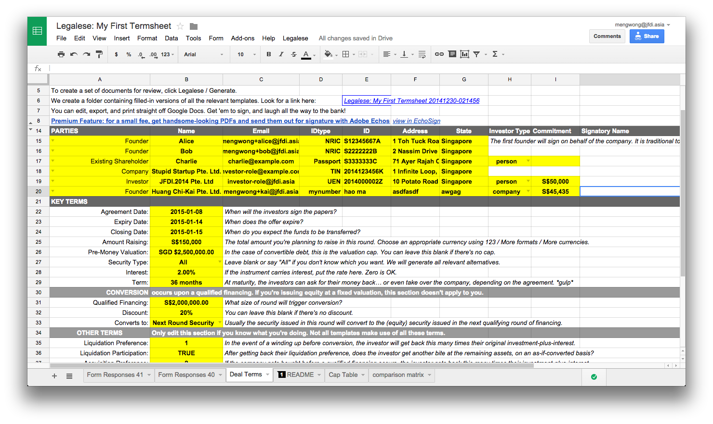
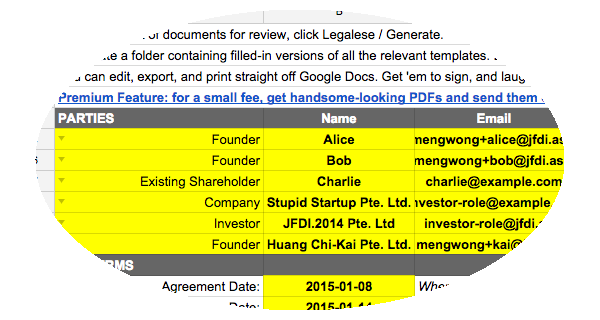
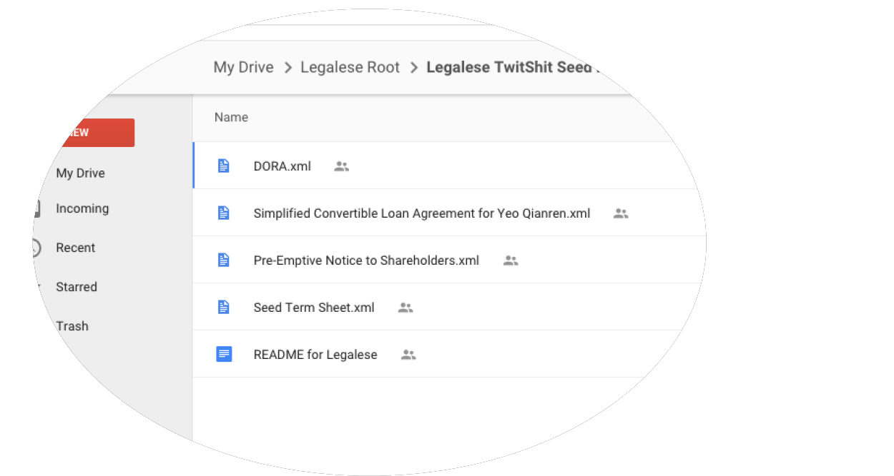
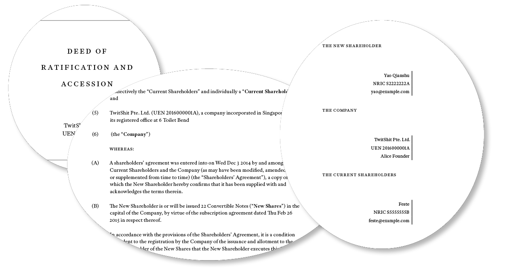
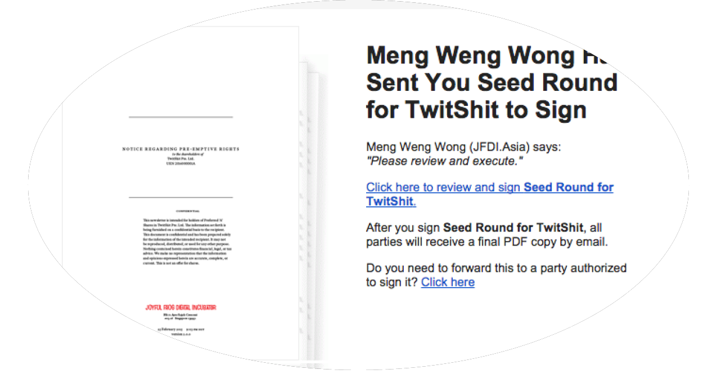

Singapore-based startup TwitShit Pte. Ltd. is raising $588,000 from a dozen investors. Leading the round is angel investor Yeo Qianren, who made his money ten years ago as an early employee at Google and has since been giving back by investing in startups. Mr Yeo has volunteered to put together the funding documents and get them signed by the other investors.

## Review the Workflow
While Legalese automates a lot of the process, you still have to understand the steps involved. Each workflow in Legalese comes with an explanatory diagram.

Lots of paperwork! Lucky for you, Legalese will generate all the necessary documents, and send them out for signature.

All you have to do is configure your company using the provided spreadsheet.

## Clone the Google Spreadsheet

## Configure The Deal
Of course, these terms are negotiated -- the major ones are the valuation cap and the discount. You definitely want to talk about those. As for the others, the spreadsheet comes configured with middle-of-the-road defaults that are neither excessively investor-friendly nor excessively founder-friendly.

## Fill in Party Particulars Yourself …

## … Or send out a Form
Click `Legalese / Create Form`. Send the link to your parties.

## Generate Documents
Click `Legalese / Generate Documents`.

Legalese's output goes to a _Legalese Root_ folder in your Google Drive.

Each time Legalese generates documents, they go into a new folder, timestamped with the current time.

Under that folder you will see a bunch of PDFs. Review those docs.

## Circulate for Signature
Open the PDF using the EchoSign Add-On and send it for signature. Look in the README file for the list of email addresses to copy and paste into EchoSign's form. They are in the correct order to match the signature blocks.

The PDF is EchoSign-ready, which means it's been marked up with signature blocks in the appropriate places. You can route the PDF through DocuSign or HelloSign as well, but they probably won't Do The Right Thing with the EchoSign signature boxes.
